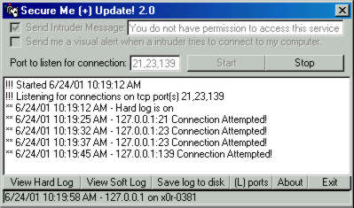



## Advanced Winsock And Parsing Secure me \+ 2\.0

### Description

After a long period of time I finally got around to updating my orig Secure me + program. In this new version there is built in parsing a new functions. now open and listen on as many ports as you want with my winsock being a array and using mid to parse. great example here. plz vote.
 
### More Info
 

             |
---                |---
**Submitted On**   |2001-06-24 10:24:08
**By**             |[meth0s](https://github.com/Planet-Source-Code/PSCIndex/blob/master/ByAuthor/meth0s.md)
**Level**          |Intermediate
**User Rating**    |4.8 (19 globes from 4 users)
**Compatibility**  |VB 3\.0, VB 4\.0 \(16\-bit\), VB 4\.0 \(32\-bit\), VB 5\.0, VB 6\.0, VB Script, ASP \(Active Server Pages\) , VBA MS Access, VBA MS Excel
**Category**       |[Internet/ HTML](https://github.com/Planet-Source-Code/PSCIndex/blob/master/ByCategory/internet-html__1-34.md)
**World**          |[Visual Basic](https://github.com/Planet-Source-Code/PSCIndex/blob/master/ByWorld/visual-basic.md)
**Archive File**   |[Advanced W216216242001\.zip](https://github.com/Planet-Source-Code/meth0s-advanced-winsock-and-parsing-secure-me-2-0__1-24388/archive/master.zip)

